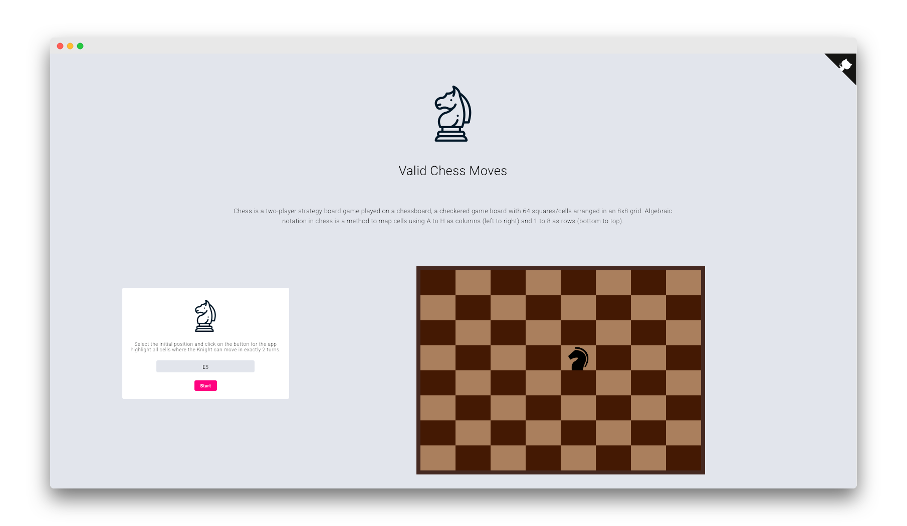

<div align="center">

# Valid Chess Moves

Chess is a two-player strategy board game played on a chessboard, a checkered game board with 64 squares/cells arranged in an 8x8 grid. Algebraic notation in chess is a method to map cells using A to H as columns (left to right) and 1 to 8 as rows (bottom to top).
A knight can move either 2 squares horizontally and 1 square vertically OR 2 squares vertically and 1 square horizontally.
The user selects the starting position and clicks the button, the application highlights all the cells where the Knight can move in exactly 2 turns. [More details in this PDF](doc/Full-Stack-assessment.pdf)

[](https://github.com/mariorodeghiero/valid-chess-moves/issues)
[](https://github.com/mariorodeghiero/valid-chess-moves/issues?q=is%3Aopen+is%3Aissue+label%3Afeature-request+sort%3Areactions-%2B1-desc)
[](https://github.com/mariorodeghiero/valid-chess-moves/issues?utf8=✓&q=is%3Aissue+is%3Aopen+label%3Abug)
[](http://opensource.org/licenses/MIT)



</div>

## Built With

- [ReactJS](https://reactjs.org) - ReactJS
- [styled-components](http://styled-components.com/) - styled-components
- [Heroku](https://www.heroku.com) - Heroku
- [Node.js](https://nodejs.org/en/) - Node.js

**Note:** [The API is available in this repository](https://github.com/mariorodeghiero/api-valid-chess-move)

## Style Guide

- [Vs Code](https://code.visualstudio.com) - ReactJS
- [Prettier](https://prettier.io) - Prettier
- [ESLint](https://eslint.org) - ESLint
- [Airbnb](https://github.com/airbnb/javascript/tree/master/react) - Airbnb
- [EditorConfig](https://editorconfig.org) - EditorConfig

**Note:** Insert "editor.formatOnSave": true into your User Settings in VSCode.

## Install

First, clone the repository via git:

```bash
git clone https://github.com/mariorodeghiero/valid-chess-moves.git your-project-name
```

And then install dependencies with yarn.

```bash
$ cd your-project-name
$ npm install
```

## Run

```bash
$ npm run start
```

After run, the browser open window automatically at http://localhost:3000/

## Deployment

Run the command below to deploy, minimizing All Files.

```bash
$ npm run build
```

## Contributing

Please read [CONTRIBUTING.md](CONTRIBUTING.md) for details on our code of conduct, and the process for submitting pull requests to us.

## Author

- [Mário Antônio do Amaral Rodeghiero](https://github.com/mariorodeghiero)

## Contributors

| [](https://github.com/mariorodeghiero) |
| --------------------------------------------------------------------------------------------------------------------- |


| [Mário Rodeghiero](https://github.com/mariorodeghiero)

## License

This project is licensed under the MIT License - see the [LICENSE.md](LICENSE.md) file for details
